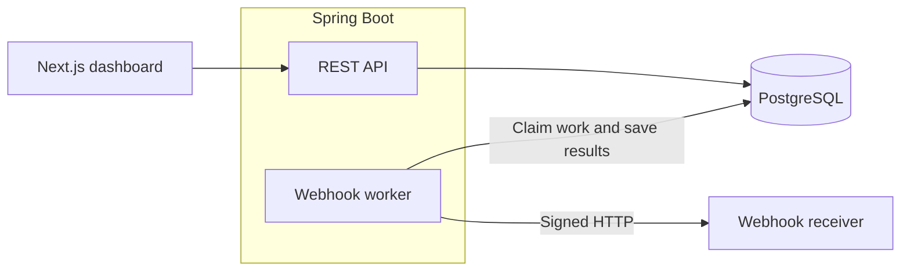

# Ledger

A small payments ledger with a dashboard for accounts, transfers, and webhook
history. Built with Java 21, Spring Boot, PostgreSQL, Next.js, and TypeScript.

The focus is on what happens when things go wrong: two transfers spending the
same balance, a request being sent twice, or a webhook receiver going offline.

## What it does

- Moves money between accounts with a debit and credit recorded together.
- Returns the original result when a request is retried with the same key.
- Locks accounts during transfers to prevent concurrent overspending.
- Sends signed webhooks, retries failures, and keeps delivery history.
- Checks account balances against the ledger through reconciliation.

Amounts are stored as integer minor units, so INR 10.00 is represented as `1000`.

## Run it

With Docker Desktop running:

```sh
docker compose up --build -d
```

Open [the dashboard](http://127.0.0.1:3000) or
[the API docs](http://127.0.0.1:8080/docs).
A fresh database includes sample accounts, with INR 25,000.00 in Northstar Commerce.

Use `docker compose down` to stop. Your balances and history are kept.

## How it fits together



A transfer saves both balances, its journal entries, the retry response, and
webhook event in one database transaction. The worker sends webhooks afterward,
so a failed notification does not undo a completed transfer.

```text
backend/    Spring Boot API, migrations, and integration tests
frontend/   Next.js dashboard and browser tests
requests/   HTTP examples for trying the API
load/       k6 scripts and recorded results
```

## Tests

Backend tests need JDK 21 and Docker:

```powershell
cd backend
.\mvnw.cmd verify
```

Use `./mvnw verify` on macOS or Linux.

Frontend tests need Node 24:

```sh
cd frontend
npm ci
npx playwright install chromium
npm test
```

With the app running, `npm run test:demo` from `frontend` checks duplicate
requests, webhook recovery, and reconciliation against the real API. It posts
INR 1.00 and saves its output in `artifacts/demo`.

For a quick manual check, open **Developer tools → Transfer requests** and send
twice in parallel. Both responses should have the same transfer ID, with only
one balance change.

## Still to do

Authentication, account permissions, secret management, and backup/restore work.
This is a local project with internal balances; it does not connect to a bank
or payment processor.
