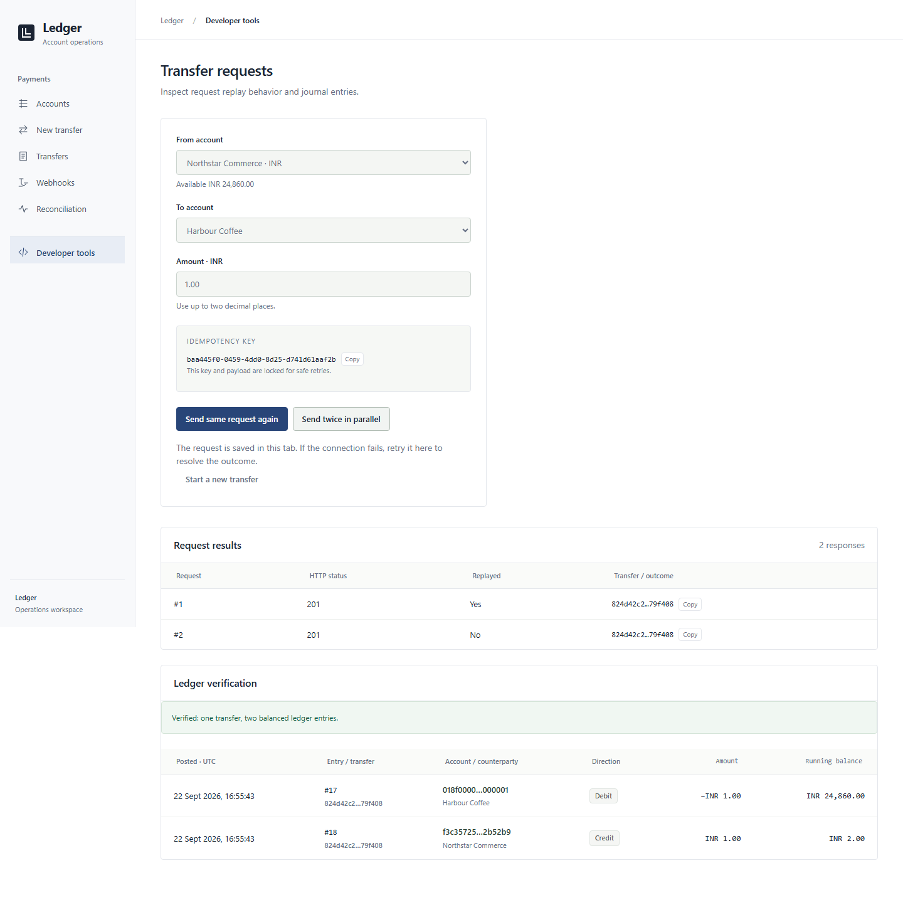
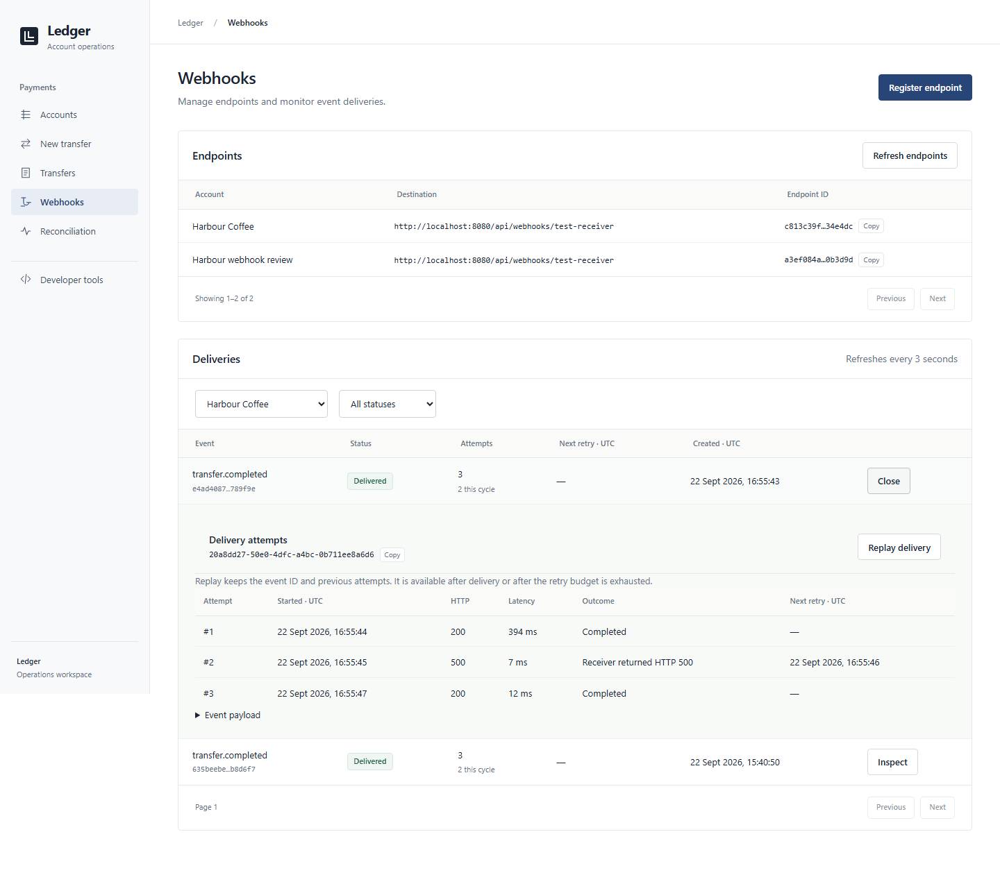

# Demo walkthrough

Start Docker Desktop's Linux engine, then run from the repository root:

```sh
docker compose up --build -d
docker compose ps
```

Wait for all three services to be healthy. Open
[Ledger](http://127.0.0.1:3000) and keep the
[API docs](http://127.0.0.1:8080/docs) in a second tab. The database volume
persists; restarting does not reset the demo. Keep this service on localhost.

## Five-minute presentation

1. **Start with the invariant.** On Accounts, open Northstar Commerce. Show its
   balance and opening funding entry. Explain that amounts are integer minor
   units and every movement has two opposite journal entries. The clearing
   account represents the external side of the local seed funding.
2. **Prepare a receiver.** Create an INR account named Harbour Coffee if it is
   not already present. On Webhooks, register it with
   `http://localhost:8080/api/webhooks/test-receiver`. Save the one-time secret
   before closing the dialog. The built-in receiver already has access to its
   own secret. In Developer tools, select Healthy. Each account can have one endpoint; do not
   register another for an account already shown in the endpoints table.
3. **Prove idempotency.** Open Developer tools → Transfer requests. Send INR 1.00 from Northstar Commerce
   to Harbour Coffee using **Send twice in parallel**. Point out the identical
   transfer IDs, two 201 responses, and one replay. Scroll to the two balanced
   journal entries. Click **Send same request again**; it replays the original
   result. The balance changed once. The key and payload remain locked together.
4. **Make failure visible.** Open Webhooks and filter to Harbour Coffee. Inspect
   the delivered event. Select Fail in Developer tools, then return to Webhooks
   and click Replay delivery. An attempt records HTTP 500 and a retry time.
   Select Healthy in Developer tools and watch recovery in Webhooks. If the retry
   budget is already exhausted, click Replay delivery again. Open deduplicated
   receipts: that event still has one receipt, even though it was delivered again.
5. **Close with evidence.** Open Reconciliation and run the check. All currency
   totals net to zero and account balances match their journals. Show the API
   docs, then the measured [load-test table](load-results.md). Explain why the
   shared account pair is slower: row locks serialize writers to the same funds.

For normal operation, use Transfers → New transfer. Select the accounts and
amount, review the details, and confirm. The receipt links to the completed
transfer. The form checks available funds before review; the backend rechecks
balances at commit. A lost response can be recovered with Check transfer status,
including after reloading the page. This flow does not expose replay controls.

Allow roughly 10–20 seconds for the webhook section. The UI polls every three
seconds, and the worker uses exponential backoff. Always finish with Healthy
selected. A slow receiver can accept an event after the sender times out, which
is why deduplication is necessary even when retries are correct.

If demonstrating an API rejection for insufficient funds, use Developer tools →
Transfer requests with an empty source account.
Its 422 response is also cached for that key. Do not represent it as a completed
transfer: rejected requests never create money movements.

## Repeatable browser check

With the Compose stack running, install Node 24 locally and run:

```sh
cd frontend
npm ci
npx playwright install chromium
npm run test:demo
```

This uses Chromium against the real service. It creates Harbour Coffee and its
local endpoint if needed, posts one INR 1.00 transfer through two parallel
requests, checks the actual balance delta and journal, replays its webhook while
the receiver fails, restores Healthy, checks recovery and one receipt, and
verifies reconciliation. It also checks desktop and 390px mobile layouts and
fails on browser runtime errors. Receiver cleanup runs even on failure.

The script updates `docs/screenshots/*.png` and `verification.json`. It does not
reset balances or erase history; each successful run intentionally adds one
transfer. Run it while nobody else is changing the same seed account. Defaults
are `DEMO_URL=http://127.0.0.1:3000` and
`DEMO_API_URL=http://127.0.0.1:8080`. The local profile and seeded Northstar account
are required. Do not point it at a production service.

## Screenshots

These are captures of the running service, not mock data or design renders.





[Accounts](screenshots/accounts.png) · [Account detail](screenshots/account-detail.png) ·
[Transfers](screenshots/transfers.png) · [System](screenshots/system.png) ·
[Mobile accounts](screenshots/accounts-mobile.png) ·
[Mobile transfer](screenshots/transfers-new-mobile.png) ·
[Mobile webhooks](screenshots/webhooks-mobile.png)

## Troubleshooting

| Symptom | Action |
| --- | --- |
| Docker engine connection fails | Start Docker Desktop and select Linux containers |
| Port 3000 is occupied | Stop the local Next.js development server before starting Compose |
| API unreachable in the browser | Check `docker compose ps` and `docker compose logs backend`; use the default localhost ports |
| A changed browser origin is blocked | Set `FRONTEND_ORIGINS` explicitly and rebuild/restart the backend |
| No webhook after a transfer | Register before transferring; old events are not backfilled |
| Replay is disabled | The delivery is still pending, processing, or retrying; wait or restore Healthy |
| Transfer outcome is unknown | Keep the tab and use Send same request again; preserve the key and payload |
| Empty seed account | Existing volumes retain prior transfers; choose a funded account or return funds with a new transfer |

`docker compose down` stops the demo and keeps its volume. Avoid deleting the
volume unless you explicitly want to lose the entire local ledger. The load
tests use a separate Compose project and do not change these accounts.
